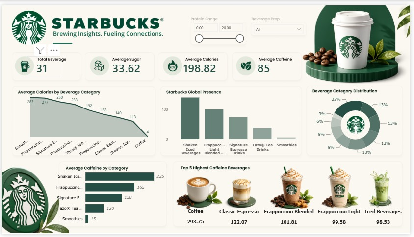

# ☕ Starbucks Power BI Dashboard

A visually interactive Power BI dashboard that analyzes Starbucks beverage data, helping users explore nutrition, caffeine, sugar, calories, and beverage categories through dynamic visualizations.

## 📌 Project Overview

This project provides insights into Starbucks beverages by analyzing their nutritional values and category distribution. The dashboard enables users to filter and compare beverages based on protein range and beverage preparation type.

## 🎯 Objectives

- Analyze Starbucks beverage nutritional information.
- Compare calories, sugar, and caffeine across beverage categories.
- Identify beverages with the highest caffeine content.
- Provide an interactive dashboard for easy data exploration.

---

## 📊 Dashboard Features

- Total Number of Beverages
- Average Sugar Content
- Average Calories
- Average Caffeine
- Average Calories by Beverage Category
- Beverage Category Distribution
- Average Caffeine by Category
- Top 5 Highest Caffeine Beverages
- Interactive Filters
  - Protein Range
  - Beverage Preparation Type

---

## 🛠️ Tools & Technologies

- Power BI Desktop
- Microsoft Excel / CSV
- Data Visualization
- DAX
- Power Query

---

## 📂 Project Structure

```
Starbucks-PowerBI-Dashboard/
│── Starbucks Dashboard.pbix
│── dataset.csv
│── directory.csv
│── dashboard.png
│── README.md
```

---

## 📈 Key Insights

- Coffee has the highest average caffeine content.
- Frappuccino beverages contain relatively high calories.
- Beverage categories differ significantly in sugar and calorie levels.
- Interactive filters allow users to explore customized insights.

---

## 📷 Dashboard Preview



---

## 🚀 How to Use

1. Download or clone this repository.
2. Open **Starbucks Dashboard.pbix** in Power BI Desktop.
3. Refresh the data if required.
4. Explore the dashboard using the available filters.

---

## 📁 Dataset

The project uses Starbucks beverage nutritional data stored in CSV format.

Files included:
- dataset.csv
- directory.csv

---

## 👨‍💻 Author

**Yogendra Singh**

- Aspiring Data Analyst
- Skilled in Power BI, SQL, Excel, and Python

---

## ⭐ If you found this project helpful, consider giving it a Star!
